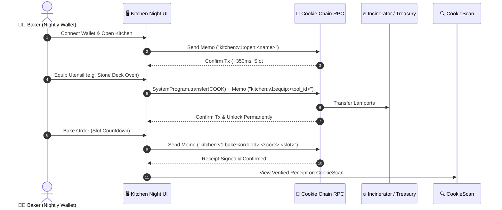

<div align="center">
  
  <h1>KITCHEN NIGHT</h1>
  <p><strong>The Real-Time SVM Bakery Arcade on Cookie Chain</strong></p>

  <p>
    <a href="https://cookiescan.io"></a>
    <a href="https://nightly.app"></a>
    <a href="https://cookieswap.fun"></a>
    
    
  </p>
</div>

---

## 🍳 Overview

**Kitchen Night** is an on-chain, fast-paced arcade dApp built natively for the **Cookie Chain** Solana Virtual Machine (SVM).

Leveraging Cookie Chain's sub-second transaction finality (~350ms) and near-zero gas costs (< $0.0001 per operation), players operate an artisan bakery empire right from their wallet. Every kitchen registration, shift bake, utensil upgrade, and achievement is committed directly on-chain via atomic SVM transactions and SPL Memo instructions.

---

## 🌟 Key Features

- **⚡ Sub-Second SVM Gameplay**: Bake orders within dynamic slot windows. Experience near-instant transaction confirmations with real-time latency tracking.
- **👛 Nightly Wallet First-Class Support**: Seamless wallet connectivity tailored for the Cookie Chain SVM ecosystem.
- **🛠️ Kitchen Pantry & Utensil Upgrades**: Equip upgraded gear (Stone Deck Oven, Blast Chiller, Golden Whisk) to boost CRUM score multipliers. Paid equipment transfers real $COOK to the on-chain treasury with permanent ownership unlock tracking.
- **🧾 On-Chain Receipts & CookieScan Verification**: Every shift generates an on-chain receipt linked directly to CookieScan explorer with exact block slot, latency, and signature details.
- **🏆 Global Leaderboard (Top 50)**: Live ranking tracking baker levels, total bakes, average latency, and net worth across all connected bakers.
- **🌉 Interactive Bridge Guide & Cookieswap Integration**: In-app onboarding modal directing users how to bridge SOL/USDC to Cookie Chain and acquire $COOK liquidity on Cookieswap.
- **🔊 Arcade Web Audio Polish**: Built-in zero-dependency Web Audio synthesizer providing satisfying audio feedback for bakes and equipment upgrades.
- **📱 Responsive Mobile Experience**: Full responsive support with mobile navigation sheet and dedicated mobile pantry page (`/pantry`).

---

## 🍪 Cookie Chain Ecosystem Integrations

Kitchen Night is deeply integrated into the Cookie Chain ecosystem:

| Ecosystem Component                                     | Integration in Kitchen Night                                                                |
| :------------------------------------------------------ | :------------------------------------------------------------------------------------------ |
| **[Cookie Chain SVM](https://docs.cookiechain.wtf)**    | High-throughput execution layer with native `$COOK` gas tokens and sub-second block times.  |
| **[Nightly Wallet](https://nightly.app)**               | Standard wallet adapter configuration optimized for Cookie Chain RPC.                       |
| **[Cookieswap](https://cookieswap.fun)**                | Direct in-app swap navigation and liquidity prompts for acquiring `$COOK`.                  |
| **[CookieScan](https://cookiescan.io)**                 | Deep-linked block explorer verification on every transaction receipt and network pulse bar. |
| **[Cookie Chain Bridge](https://docs.cookiechain.wtf)** | Interactive modal with 3-step bridge tutorial and copyable RPC parameters.                  |

---

## 🏗️ Architecture & Memo Protocol

Kitchen Night uses an efficient on-chain protocol powered by the Solana SPL Memo Program (`MemoSq4gqABAXKb96qnH8TysNcWxMyWCqXgDLGmfcHr`).



### Protocol Instruction Specification

```
1. Open Kitchen:
   kitchen:v1:open:<kitchen_name>

2. Bake Shift Order:
   kitchen:v1:bake:<order_id>:<crum_score>:<slot_number>

3. Equip Tool / Upgrade:
   kitchen:v1:equip:<tool_id>
   (Accompanied by SystemProgram.transfer for paid tools)
```

### Multi-Tier Persistence Model

To ensure maximum reliability without requiring heavy centralized database servers:

1. **Tier 1 (Instant)**: Fast local cache (`localStorage`) for millisecond UI hydration.
2. **Tier 2 (Cross-Device)**: Lightweight API cache (`/api/kitchen/[wallet]`) to synchronize state across devices using the same wallet.
3. **Tier 3 (Ground Truth)**: On-chain transaction signature reconstruction from Cookie Chain RPC.

---

## ⚙️ Network Configuration

| Parameter            | Value                                          |
| :------------------- | :--------------------------------------------- |
| **Network**          | Cookie Chain Mainnet (SVM)                     |
| **RPC Endpoint**     | `https://rpc.cookiescan.io`                    |
| **Genesis Hash**     | `9wDaBRDgArEUpvhHxGguNkwozsZh4UpGZB9o2EoEcBB2` |
| **Native Gas Token** | `$COOK` (9 Decimals)                           |
| **Memo Program**     | `MemoSq4gqABAXKb96qnH8TysNcWxMyWCqXgDLGmfcHr`  |
| **Treasury Address** | `1nc1nerator11111111111111111111111111111111`  |
| **Explorer**         | `https://cookiescan.io`                        |

---

## 🚀 Getting Started

### Prerequisites

- [Node.js](https://nodejs.org/) v18+ or v20+
- [pnpm](https://pnpm.io/) v9+
- [Nightly Wallet](https://nightly.app/) browser extension with Cookie Chain network added

### Installation

```bash
# Clone the repository
git clone https://github.com/POA200/kitchen-night.git
cd kitchen-night

# Install dependencies
pnpm install

# Start local development server
pnpm dev
```

Open [http://localhost:3000](http://localhost:3000) in your browser.

### Build for Production

```bash
# Typecheck
pnpm --filter web check-types

# Compile Next.js production build
pnpm --filter web build
```

---

## 📜 License

MIT License — see [LICENSE](LICENSE) for details.
